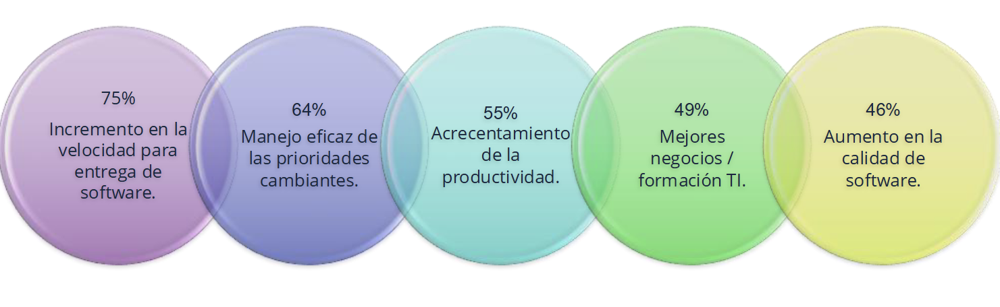
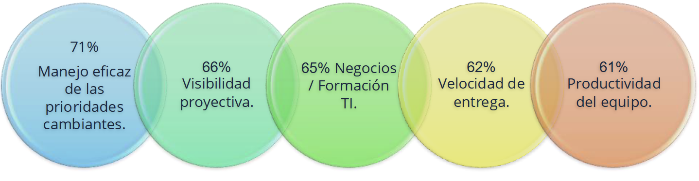

# ¿Que es la agilidad?

- Se refiere a la capacidad de adaptarse a cambios para crear productos y servicios de valor en ambientes VUCA (`V.U.C.A`: `Volatility`,`Uncertainity`,`Complexity`,`Ambiguity`)

## ¿Porque utilizar agilidad en proyectos?

Lo que tienen en común empresas como Google, Apple, Facebook, Amazon y Microsoft, además de otras como: Netflix, Airbnb, Tesla y Uber es que centran sus esfuerzos en:

- Conocer el comportamiento y sentimiento de sus clientes.
- Predecir nuevas tendencias e incluso crearlas.
- Simplificar y automatizar sus procesos para mejorar la experiencia de sus clientes.
- Se adaptan a los cambios constantes, inciertos y volátiles.
- Gestionan de la mejor forma los datos e información que tiene en todos los
  puntos.

## Razones para adoptar AGILE

## Beneficios de implementar AGILE

## Manifiesto Ágil

En 2001 un grupo de profesionales de software decidio reunirse y conversar sobre como los modelos de trabajo (metodologias) que se llevaban hasta ahora eran muy pesados y rigidos. Buscaban algo que diera respuestas mas ágiles a los clientes y que se adaptase a un mundo cambiante y cada vez más exigente. De ahí viene el término genérico de `Ágil` o `Agile`

### Los 4 valores del manifiesto ágil

1. Individuos e interacciones por encima de los procesos y herramientas
2. Colaboración con el cliente por encima de negociación del contrato
3. Responder al cambio por encima de seguir el plan
4. Un producto que funciona por encima de una documentación exhaustiva

## Los 12 principios del Manifiesto Ágil

1. Nuestra mayor prioridad es satisfacer al cliente mediante la entrega temprana y continua de software valioso.
2. Aceptamos que los requisitos cambien, incluso en etapas tardías del desarrollo. Los procesos ágiles aprovechan el cambio para proporcionar ventaja competitiva al cliente.
3. Entregamos software funcional frecuentemente, entre dos semanas y dos meses, de preferencia al menor tiempo posible.
4. Los responsables de negocio y los desarrolladores deben trabajar juntos de forma cotidiana durante todo el proyecto.
5. Los proyectos se desarrollan en torno a individuos motivados. Hay que darles el entorno y el apoyo que necesitan y confiarles la ejecución del trabajo.
6. El método más eficiente y efectivo de comunicar información al equipo de desarrollo y entre sus miembros es la conversación cara a cara.
7. El software funcionando es la medida principal de progreso.
8. Los procesos ágiles promueven el desarrollo sostenible. Los patrocinadores, desarrolladores y usuarios deben ser capaces de mantener un ritmo constante de forma indefinida.
9. La atención continua a la excelencia técnica y al buen diseño mejora la agilidad.
10. La simplicidad o el arte de maximizar la cantidad de trabajo no realizado, es esencial.
11. Las mejores arquitecturas, requisitos y diseños emergen de equipos autoorganizados.
12. A intervalos regulares el equipo reflexiona sobre cómo ser más eficaz para después ajustar y perfeccionar su comportamiento según corresponda.
