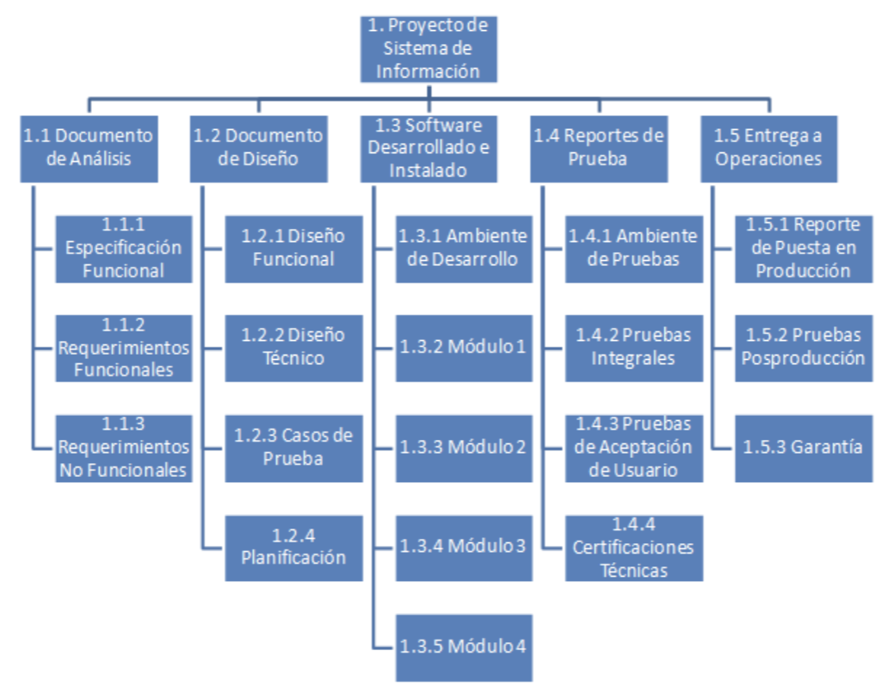

# WBS (o EDT)

La estructura de desglose de trabajo, consiste en descomponer el producto resultante de un proyecto, en paquetes de trabajo individuales. Esta descomposición se realiza de manera jerarquica

Es creada por el equipo del proyecto, con el fin de que todos conozcan y entiendan el flujo de trabajo.

## Ejemplo

## ¿En que se relaciona un WBS con la identificación de riesgos?

Debido a que con el WBS podemos descomponer los trabajos y conocer los entregables en cada etapa del proyecto, es una buena herramienta para identificar riesgos en cada etapa del trabajo, buscando asi una identificación mas especifica.

# RBS

Es una estructura muy parecida al WBS, pero el fin de esta es agrupar distintas fuentes de riesgos, generando una categorización de ellas.

Luego de realizar la estructura de desglose de riesgos, el equipo puede ir formulando una lluvia de ideas que permitan generar una revisión del RBS y observar si nos falta algo por analizar
